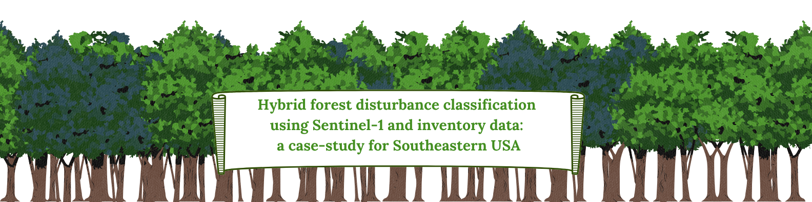
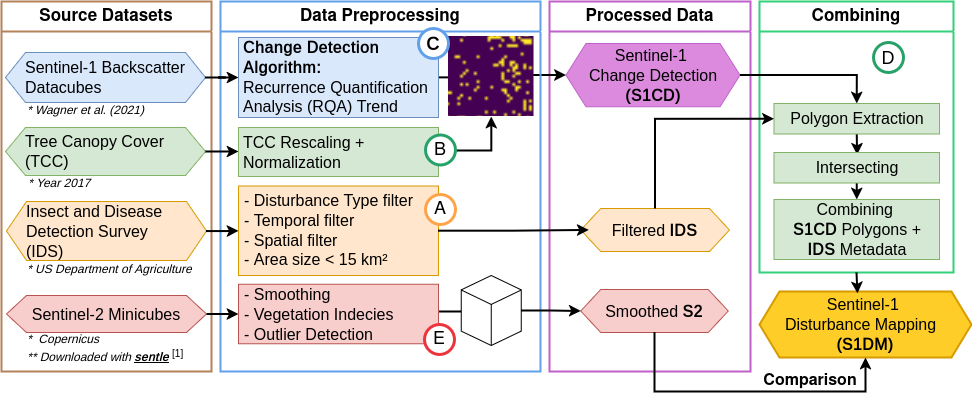

# Hybrid forest disturbance classification using Sentinel-1 and inventory data: a case-study for Southeastern USA

**Authors:** Franziska Müller, Laura Eifler, Felix Cremer, Gustau Camps-Valls, Ana Bastos

**Affiliation:** Universität Leipzig / MPI for Biogeochemistry

**License:** MIT

---

## Abstract

Global forest ecosystems face unprecedented challenges from fire, wind, drought, and insect outbreaks, resulting in rapid forest decline. Analysing these disturbances at scale requires remote sensing, but spatial and temporal uncertainty in existing reference data remains a significant obstacle. In this study, we validate and refine disturbance labels from the USDA Forest Service Insect and Disease Survey (IDS) using a change detection algorithm based on Sentinel-1 SAR data. We analyse the spatio-temporal overlap between Sentinel-1 detections and IDS labels across USFS Region 8 (south-eastern US, 2016–2020), covering bark beetle, wind, and defoliator disturbances. The resulting improved disturbance mapping (S1DM) provides a more reliable basis for ecological research and land management.

---

## Paper & Data

> **Paper:** *Hybrid forest disturbance classification using Sentinel-1 and inventory data: a case-study for Southeastern USA*
>
> **EGUsphere preprint, 2025:** https://egusphere.copernicus.org/preprints/2025/egusphere-2025-4880/
>
> **DOI:** https://doi.org/10.5194/egusphere-2025-4880
>
> **Output Data Repository:** Zenodo to be added

> **Input Data:**
>
> | Dataset                           | Description                                    | Source                                                       |
> | --------------------------------- | ---------------------------------------------- | ------------------------------------------------------------ |
> | USDA IDS disturbance polygons     | Forest disturbance survey, CONUS               | [USDA Forest Health Protection](https://www.fs.usda.gov/science-technology/data-tools-products/fhp-mapping-reporting/detection-surveys) |
> | IDS preprocessed for Region 8     | Filtered and harmonised IDS labels             | Preprocessing code available at [Eifler et al. (2026)](https://github.com/lauraeifler/Eifleretal2026_Disturbance_Data_Comparison)  |
> | NLCD Tree Canopy Cover            | Annual forest mask rasters, CONUS              | [USDA Forest Service](https://data.fs.usda.gov/geodata/rastergateway/treecanopycover/) |
> | USFS Region 8 boundary            | Administrative region shapefile                | [USDA Forest Service EDW](https://data.fs.usda.gov/geodata/edw/datasets.php?dsetCategory=boundaries) ; also provided in `data/` |
> | Sentinel-1 change detection tiles | NetCDF tiles, EQUI7 grid, 20 m                 | Zenodo repository (to be added)                              |
> | Manual validation labels          | GeoJSON polygons digitized from Planet imagery | Provided in `data/manual_planet_labels/`                     |


---

## Pipeline overview



```
main.py --run-ids     → filter and reproject USDA IDS disturbance polygons
main.py --run-tcc     → prepare NLCD Tree Canopy Cover masks (one per year)
main.py --run-s1cd    → intersect Sentinel-1 detections with IDS polygons → S1DM
main.py --run-plotter → generate all analysis figures and summary statistics
```

**Required input data:**

| Data                     | Description                                                  |
| ------------------------ | ------------------------------------------------------------ |
| IDS polygons             | Forest Health Protection disturbance survey, CONUS, Region 8 |
| Sentinel-1 SAR tiles     | Change detection NetCDF files, EQUI7 grid, 20 m resolution   |
| NLCD Tree Canopy Cover   | Annual rasters (CONUS), used as forest mask                  |
| USFS region boundary     | Administrative region shapefile (Region 8)                   |
| Manual validation labels | GeoJSON polygons digitised from Planet imagery (provided in `data/`) |

**Outputs:**

| Output                   | Location                                                     |
| ------------------------ | ------------------------------------------------------------ |
| Filtered IDS shapefile   | `RESULTS_DIR/region_08_dca_filtered_ids_usda_polygons_espg_27705.shp` |
| S1DM shapefile           | `RESULTS_DIR/radar_enhanced_forest_disturbance_mapping_region_08_buffer_500_s1dm.shp` |
| Overlap/omission summary | `RESULTS_DIR/region_08_overlap_omission_summary_buffer_500.csv` |
| Size/shift statistics    | `RESULTS_DIR/region_08_size_shift_stats_buffer_500.csv`      |
| Figures                  | `FIGURES_DIR/p1_f1_*.png` … `p1_f11_*.png`                   |

---

## Requirements

Python 3.12. Tested with conda environment `emp`. All required packages and their exact versions are listed in `requirements.txt`.

Key dependencies:

| Package       | Version  |
| ------------- | -------- |
| geopandas     | 1.0.1    |
| shapely       | 2.0.6    |
| rasterio      | 1.3.10   |
| rioxarray     | 0.17.0   |
| xarray        | 2026.1.0 |
| pandas        | 2.2.2    |
| numpy         | 1.26.4   |
| matplotlib    | 3.9.2    |
| seaborn       | 0.13.2   |
| scipy         | 1.14.1   |
| python-dotenv | 1.0.1    |
| GDAL          | 3.9.2    |

Install:

```bash
pip install -r requirements.txt
```

GDAL must also be available on `PATH` (used via `gdalwarp` in the TCC step).

---

## Setup

### 1. Copy and edit the environment file

```bash
cp environment/.env.example environment/.env
```

Edit `environment/.env`. Set these paths for your system:

| Variable              | Points to                                 | Data source                                                  |
| --------------------- | ----------------------------------------- | ------------------------------------------------------------ |
| `FOREXD_DIR`          | **Absolute path to this repository root** | /                                                            |
| `DATA_DIR`            | Root directory of all input datasets      | --  please set the data sources below accordingly            |
| `SENTINEL1_TILES_DIR` | Sentinel-1 change detection NetCDF tiles  | Zenodo (see Data above)                                      |
| `IDS_REGIONS_DIR`     | USDA IDS CONUS table directory            | [Eifler et al. (2026)](https://github.com/lauraeifler/Eifleretal2026_Disturbance_Data_Comparison) (see Data above) |
| `TCC_DIR`             | NLCD Tree Canopy Cover raster directory   | [USDA Forest Service](https://data.fs.usda.gov/geodata/rastergateway/treecanopycover/) |
| `REGION_SHAPE_DIR`    | USFS region boundary shapefile directory  | Provided in `data/S_USA.AdministrativeRegion/`               |
| `MANUAL_DIR`          | Manual validation GeoJSON labels          | Provided in `data/manual_planet_labels/`                     |

The following settings must stay at their defaults:

| Variable        | Default     | Description                                                  |
| --------------- | ----------- | ------------------------------------------------------------ |
| `REGION`        | `8`         | USFS region number                                           |
| `TCC_THRESHOLD` | `0.3`       | Minimum tree canopy cover (0–1) to classify a pixel as forest |
| `TARGET_CRS`    | `EPSG:4326` | CRS of output shapefiles                                     |

---

## Running the pipeline

### On HPC with SLURM

Set your email in `src/run_main.sh`, then:

```bash
cd src
sbatch run_main.sh
```

or if not in a SLURM environment:

```bash
cd src
./run_main.sh
```

### Locally

```bash
conda activate emp
cd src
python main.py \
    --env ../environment/.env \
    --start-year 2016 \
    --end-year 2020 \
    --buffer-years 2 \
    --spatial-buffer 500 \
    --max-jobs 10 \
    --run-ids \
    --run-tcc\
    --run-s1cd \
    --run-plotter
```

**Stage flags:**

| Flag            | Runs                 | Notes                                          |
| --------------- | -------------------- | ---------------------------------------------- |
| `--run-ids`     | IDS filtering        | Re-run if IDS input data changes               |
| `--run-tcc`     | TCC mask preparation | Only needed once; output is shared across runs |
| `--run-s1cd`    | S1CD ↔ IDS matching  | Re-run if IDS or S1CD data changes             |
| `--run-plotter` | All figures          | Requires IDS and S1CD outputs to exist         |

---

## Repository structure

```
ForExD-WP1-P1/
├── environment/
│   └── .env.example              # Configuration template
├── src/
│   ├── main.py                   # Pipeline entry point
│   ├── ids_processor.py          # Stage 1 — IDS filtering
│   ├── tcc_processor.py          # Stage 2 — TCC mask preparation
│   ├── s1cd_processor.py         # Stage 3 — S1CD matching
│   ├── plotter.py                # Stage 4 — figure generation
│   ├── func_data_preprocessing.py
│   ├── func_file_io.py
│   ├── func_helper.py
│   ├── func_plots.py
│   ├── func_s1cd_preprocessing.py
│   ├── func_tcc_application.py
│   └── run_main.sh               # SLURM submission script
├── data/
    ├── manual_planet_labels/     # Manual validation GeoJSON (per event)
    ├── manual_labels_idx_lookup.csv  # Mapping of manual folder names to current IDX_D
    └── S_USA.AdministrativeRegion/   # USFS region boundary shapefile
```

---

## Reproducibility

Results are fully deterministic: tile processing order is fixed alphabetically. The TCC threshold of 0.3 (30 % tree canopy cover) and spatial buffer of 500 m match the values reported in the paper. To reproduce the exact paper results, use the data provided in the data repository linked above.

> **Note:** Due to floating-point precision in the spatial buffer operation (`GeoDataFrame.buffer()`), results may differ from the original paper by up to ~0.3 % of events. This is within the expected range of spatial join noise and does not affect any scientific conclusions.
