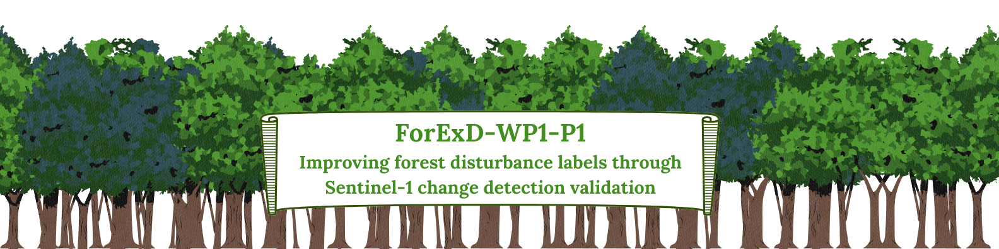

# ForExD-WP1-P1
This repository contains the codebase for my first project in my PhD work. It aims to improve forest disturbance labels by using Sentinel-1 Change Detection Data validate the preexisting data.

📚 **Abstract**
---------------
Global forest ecosystems face unprecedented challenges, such as fire, wind, drought, and insect outbreaks, resulting in rapid forest decline. Analyzing these disturbances on a large scale requires the use of remote sensing techniques, but the spatial and temporal uncertainty in forest disturbance reference data poses a significant obstacle.  
In this study, we validate and refine existing disturbance labels of the U.S. Forest Service Forest Health Protection Dataset USDA by using a change detection algorithm based on radar data from Sentinel-1.  
To this end, we analyze the spatio-temporal overlap of disturbed areas from Sentinel-1 with the USDA labels and further explore spatio-temporal fingerprints of remote sensing indices commonly used for disturbance detection. As the analysis of the remote sensing indices shows, this refinement of the accuracy of disturbance labels provides a more reliable basis for ecological research and land management practice.

📁 **Organisation of the Code**
--------------------------------
The codebase is organized as follows:
- `/src`: Contains the source code files.
- `/data`: Contains datasets used in the project.
- `/results`: Contains output files and results generated by the code.
- `/docs`: Contains documentation or additional resources related to the project.

🔬 **Methods**
--------------
The methods employed in this project include:
- Method A: [Brief explanation of Method A]
- Method B: [Brief explanation of Method B]
- ...

🏃‍♂️ **How to Run the Code**
----------------------------
To run the code, follow these steps:
1. Clone the repository: `git clone https://github.com/Franziska279/ForExD-WP1-P1.git`
2. Navigate to the project directory: `cd ForExD-WP1-P1`
3. ....

🔍 **Known Issues**
-------------------
- [List any known issues or limitations of the code.]

👥 **Authors, Licenses, etc.**
-------------------------------
- **Authors**: FRanziska Müller, Laura Eifler, Felix Cremer, Prof. Dr. Gustau Camps-Valls, Prof. Dr. Ana Bastos
- **License**: MIT
- **Acknowledgments**: Uni Leipzig, MPI, .....
